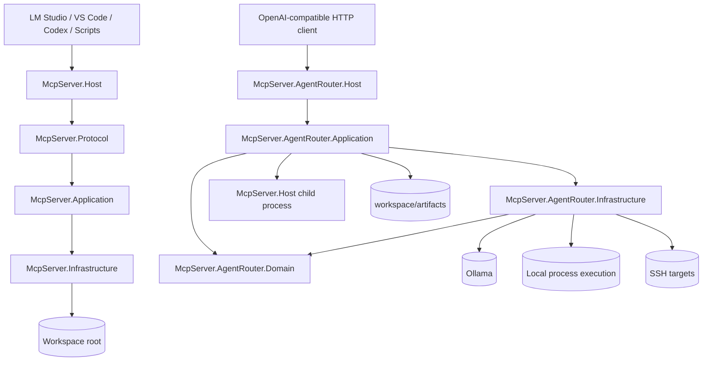

# Architecture

## Overview

The repo contains two related but separate host surfaces:

- `McpServer.Host`: a stdio MCP server for tools, resources, prompts, and bounded local-model preparation.
- `McpServer.AgentRouter.Host`: a loopback HTTP router that exposes OpenAI-style chat completions plus bounded execution endpoints for MCP tools, shell, SSH, runs, and autonomous loops.

The AgentRouter does not embed the stdio host. It launches `McpServer.Host` as a child process when it needs MCP tool catalog discovery or MCP tool execution.

## Host topology

## `McpServer.Host` layering

| Project | Responsibility |
| --- | --- |
| `src/McpServer.Host` | Process startup, Serilog bootstrap, Autofac registrations, stdio hosted service |
| `src/McpServer.Protocol` | JSON-RPC request dispatch, MCP lifecycle handlers, routers, session state |
| `src/McpServer.Application` | Tool/resource/prompt/activity abstractions and handlers |
| `src/McpServer.Infrastructure` | Filesystem, path policy, process execution, SSH, web, Ollama, logging |
| `src/McpServer.Domain` | Workspace boundary state, path resolution, and mutation rules |

Key properties:

- newline-delimited stdio JSON-RPC transport
- workspace-aware path validation and mutable project-root context
- optional high-risk capabilities disabled by default
- `LanguageExt.Fin<T>` result flow across application and infrastructure boundaries

## `McpServer.AgentRouter.Host` layering

| Project | Responsibility |
| --- | --- |
| `src/McpServer.AgentRouter.Host` | ASP.NET Core minimal API host, endpoint mapping, startup lifecycle, HTTP error mapping |
| `src/McpServer.AgentRouter.Application` | model invocation flow, run storage, MCP tool-call services, shell/SSH policies, autonomous loop orchestration |
| `src/McpServer.AgentRouter.Domain` | run, loop, inference, MCP, shell, and SSH domain models plus state transitions |
| `src/McpServer.AgentRouter.Infrastructure` | Ollama client, stdio MCP bridge, process shell executor, SSH.NET execution, profile loading |

Key properties:

- loopback HTTP host with OpenAI-compatible `chat/completions`
- startup lifecycle can verify run storage, Ollama, and MCP stdio tool catalog readiness
- the host owns the wire DTOs and configuration models for AgentRouter; the application and infrastructure layers consume runtime settings and domain models instead
- the AgentRouter domain owns run, loop, and execution state instead of leaving those concepts as transport DTOs
- bounded execution surfaces with allowlists and durable trace writing
- durable artifact storage under `workspace/artifacts`

## Runtime flows

### `McpServer.Host`

1. `Program.cs` builds the generic host from the explicit content root and loads `AutofacRootModule`.
2. `StdioServerHostedService` opens stdin/stdout and owns the request loop.
3. `McpSession` gates lifecycle state.
4. `ToolCallRouter`, `ResourceReadRouter`, and `PromptRouter` dispatch into application handlers.
5. Infrastructure services enforce workspace/path/process/web/SSH policy before any side effects.

### `McpServer.AgentRouter.Host`

1. `Program.cs` binds `AgentRouterOptions`, registers services, and maps endpoints.
2. `AgentRouterStartupLifecycleService` validates runtime prerequisites when enabled.
3. `/v1/chat/completions` maps OpenAI-style requests into `IModelRouter`.
4. `/agent/mcp/tools` and `/agent/mcp/tools/call` bridge to `McpServer.Host` over stdio.
5. `/agent/shell/exec` and `/agent/ssh/exec` pass through policy services before executor adapters run.
6. `/agent/loops` coordinates planner, policy, executor, inspector, validator, and trace writer.
7. `/agent/runs` persists run inputs, outputs, and artifacts to disk.

## Public surfaces

### `McpServer.Host`

- Tools: filesystem, workspace, activity, and optional shell/web/SSH/inference tools
- Resources: file text, metadata, directory listings, tree snapshots, recent change feed
- Prompts: file summarization and directory review

### `McpServer.AgentRouter.Host`

- `GET /health`
- `GET /v1/models`
- `POST /v1/chat/completions`
- `GET /agent/mcp/tools`
- `POST /agent/mcp/tools/call`
- `POST /agent/shell/exec`
- `POST /agent/ssh/exec`
- `POST /agent/loops`
- `POST /agent/runs`
- `GET /agent/runs/{id}`

## Safety boundaries

- The stdio host is the only MCP tool boundary; AgentRouter does not bypass it for MCP tool calls.
- `McpServer.Host` disables shell, SSH, web, and Ollama by default.
- AgentRouter keeps cloud providers off by default and rejects non-loopback Ollama URLs unless explicitly allowed.
- AgentRouter web search uses a configurable base URL, and local loopback/private targets can be explicitly enabled for controlled test harnesses.
- AgentRouter SSH can be switched to a deterministic test backend when integration coverage needs to avoid a live SSH target.
- AgentRouter MCP tool calls, shell commands, and SSH commands are all policy-gated before execution.
- Trace files are written for MCP tool calls, shell execution, SSH execution, loops, and agent runs.

## Test coverage split

- `tests/McpServer.UnitTests`: stdio host unit coverage
- `tests/McpServer.IntegrationTests`: stdio host end-to-end plus deterministic loopback/test-backend coverage
- `tests/McpServer.AgentRouter.UnitTests`: router policy, run, loop, MCP bridge, shell, SSH, inference, and path-resolution coverage
